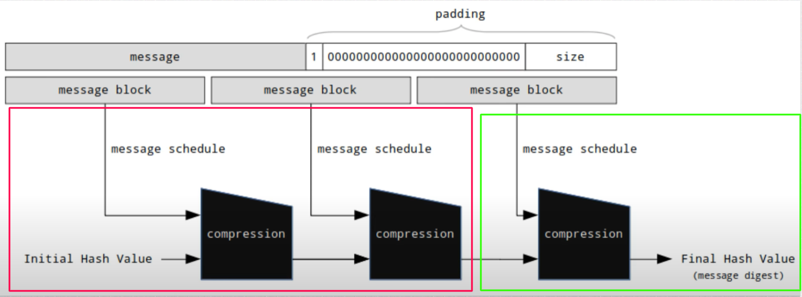

# O1JS Dynamic/Partial SHA256

This package provides cryptographic primitives for SHA256 verification in [o1js](https://docs.minaprotocol.com/zkapps/o1js/) supporting dynamic length input as well as partial hash computation. It also provides utility functions for input generation for both dynamic and partial SHA256 primitives.

## Arbitrary Length SHA256 Hashing

This is also referred to as dynamic SHA256, an innovation first introduced by zkEmail for zk-email verification to work on all emails [up to some reasonable length](https://blog.aayushg.com/zkemail/#arbitrary-length-sha256-hashing:~:text=zk%2Demail%20works%20on%20all%20emails%2C%20up%20to%20some%20reasonable%20length%2C).

> Dynamic SHA256 serves to verify all messages with the same verifier circuit, allowing hashing of all messages up to any maximum length.

In this package, the `dynamicSHA256` provable function works differently from the native [SHA256 Gadget](https://github.com/o1-labs/o1js/blob/main/src/lib/provable/gadgets/sha256.ts).

- The `SHA256 Gadget` in o1js takes the preimage bytes and returns the digest as `32` provable `Bytes`.

- The `dynamicSHA256` provable function, on the other hand, takes the [padded](https://www.tony.software/posts/sha256_building_hash_algorithm_scratch/#:~:text=Initially%2C%20the%20length,bit%20padded%20message%3A) preimage blocks as bytes that are zero-padded up to a constant maximum size.

- Since the padded preimage is a multiple of 512-bit blocks (64 bytes), the zero-padding should also be a multiple of 64.

- For example, if we set a constant max size of `640` bytes for the input of `dynamicSHA256`, and the padded preimage results in `2` 512-bit blocks, the remaining `8` blocks will be padded with zero by the `dynamicSHA256Pad` helper function.

- The `dynamicSHA256` provable function also requires a `digestIndex` input, which is crucial to return the correct digest upon dynamic hashing.

- The `digestIndex` is also essential for asserting the correctness of **zero padding** and will reject any padded preimage that is not correctly zero-padded to the set max length.

Please use the [dynamicSHA256Pad](https://github.com/Shigoto-dev19/o1js-dynamic-sha256/blob/main/src/helpers.ts#L7-L32) helper function to generate the correct inputs for the `dynamicSHA256` provable function.

### Notes

- **Arbitrary Length SHA256 Hashing**:

  - This does not have the same constraints as the standard `SHA256`. It has the same constraints as hashing the full padded bytes.
  - For example, a preimage of `64` bytes would require `8970` kimchi rows to hash with the native SHA256 gadget in o1js. However, hashing the same preimage padded to `1024` bytes would cost `92675` rows when hashing with `dynamicSHA256`. This is because dynamic hashing hashes all message blocks inside the compression function and only returns the correct digest based on the `digestIndex`. In other words, its performance is the same as hashing a preimage with the set max length.

- **Performance Considerations**:

  - Hashing the same preimage without extra zero padding is generally faster with dynamic hashing for most small-size preimages. This is because dynamic hashes have fewer constraints due to padding the preimage outside the SNARK.
    - Saved Padding Constraints:
      - 1024-byte preimage: `2561` rows
      - 1536-byte preimage: `3841` rows

- **Dynamic Hashing Constraints**:

  - Dynamic hashing has more constraints than standard hashing for large-size preimages due to the security check called `assertZeroPadding` integrated within `dynamicSHA256`.
    - This check ensures that after the `paddingStartIndex` (calculated based on the `digestIndex` input), the padded preimage is correctly padded after the last block of the **standard SHA256 padding**. This prevents the user from inputting any falsely padded preimage and ensures the `dynamicSHA256` returns the **correct** digest, enforcing the correct `digestIndex` and zero-padding starting from the correct `paddingStartIndex`.
    - Constraint Cost Examples:
      - Standard SHA256 (1024-byte) rows: `90570`
      - Dynamic SHA256 (1024-byte) rows: `92675`
      - `assertZeroPadding` Constraint Costs:
        - 1024-bytes: `1792` rows
        - 1536-bytes: `2688` rows

- **Circuit Considerations**:

  - Proof generation for any circuit using `dynamicSHA256` will fail if the inputs do not meet the following requirements:
    - The array length must be a multiple of 16. If the size of the padded preimage is not a multiple of 64, it will result in an error.
      - Accepted paddings: `Bytes(128)`, `Bytes(1024)`
      - Rejected padding: `Bytes(200)`
    - An error message of `Array length must be a multiple of 16` will appear if this condition is not met.
    - `Padding error at index _: expected zero.` error if the `digestIndex` is not correct.
    - The same error message will appear if the `digestIndex` is correct but the extra-padded bytes are any byte other than zeros.

## Partial SHA256 Hashing

Partial SHA256 reduces constraints on SHA256 hashing for large preimages. It focuses on hashing the message blocks of the preimage outside the SNARK, up to the substring in the preimage. The remaining message blocks are then hashed via arbitrary length SHA256 inside the SNARK.

Quoting from [zkEmail](https://blog.aayushg.com/zkemail/#arbitrary-length-sha256-hashing:~:text=The%20way%20sponge,verification%20faster%20everywhere!):

> The preimage string gets split into blocks which get hashed successively, each combined with the result of the last. So you can hash all the blocks up to the one you need outside the snark, and then only run the last few hashing blocks inside the snark. What you’re proving is not “I have a string that hashes to this value”, but rather, “I have a substring that I can combine with the partially computed hash to yield the correct final hash value.” This trick works for any sponge or Merkle-Damgard hash function, and can make knowledge of hash preimage verification faster everywhere!



In the context of this package, the `partialSHA256` is a modified version of `dynamicSHA256`.

- It takes a `precomputedHash` as the initial hash value instead of the default value set by the SHA2 standards, and the remaining blocks are hashed inside the SNARK the same as in dynamic hash.

  - The precomputed hash is parsed from `Bytes(32)` to an array of 8 `UInt32` elements.
  - The remaining message blocks are also zero-padded up to a constant max length, the same as in dynamic SHA.
  - The inputs of the provable function `partialSHA256` should be correctly generated using the helper function [generatePartialSHA256Inputs](https://github.com/Shigoto-dev19/o1js-dynamic-sha256/blob/main/src/helpers.ts#L34-L74).

- As illustrated in the figure above, for instance, if the first two message blocks are precomputed, only the last block will undergo hashing inside the compression function.

- Because hashing within `partialSHA256` is also dynamic, the computational cost of hashing the last block is proportional to the maximum size set for the remaining message blocks, similar to what is explained in dynamicSHA256.

### Notes

- **zkEmail Context**:

  - Partial SHA256 is a great optimization for the email's body hash proof of integrity.

- **Helper Function Selector**:

  - If empty, the default SHA256 initial state is used.
  - If the selector does not exist in the original preimage, the helper will throw an error.

- **Precomputed Incorrectness**:

  - This indicates false knowledge of a chunk of the preimage, resulting in an incorrect final digest.
  - This should be asserted against a public input to prove integrity; otherwise, the circuit will not complain.

## How to use the package

Install the package

```sh
npm install dynamic-sha256
```

### Dynamic SHA256

#### Input Generation

Import the helper function `dynamicSHA256Pad` to generate inputs for the provable function `dynamicSHA256`.

- Example: Generate padding up to `1024` bytes

  ```typescript
  import { dynamicSHA256Pad } from 'dynamic-sha256';

  // Generate inputs for dynamic SHA-256
  const [paddedPreimage, digestUndex] = dynamicSHA256Pad(preimageBytes, 1024);
  ```

#### Arbitrary Length Hashing

- For any zkapp, compute the SHA256 hash of any input up to the maximum size set (e.g., 1024).

  ```typescript
  import { dynamicSHA256 } from 'dynamic-sha256';

  const digest = dynamicSHA256(paddedPreimage, digestIndex);
  ```

- Please note that it's crucial to declare the correct `Bytes type` according to the set size of dynamic SHA256. For instance, if the maximum size is set to `1024`, declare a `Bytes1024` type as follows:

  ```ts
  class Bytes1024 extends Bytes(1024) {}
  ```

- For better clarity, refer to the [zkProgram examples](https://github.com/Shigoto-dev19/o1js-dynamic-sha256/blob/main/src/zkProgram.ts#L45-L56) for better clarity.

### Partial SHA256

#### Input Generation

- Import the helper function `generatePartialSHA256Inputs` to generate inputs for the provable function `partialSHA256`.

- Precompute the hash outside the circuit up to the block that contains the substring selector in the preimage, and then pad the remaining blocks up to the maximum size set (e.g., 1536 bytes).

- Example: Generate padding up to `1536` bytes.

  ```typescript
  import { generatePartialSHA256Inputs } from 'dynamic-sha256';

  // Convert the random string to bytes
  const preimageBytes = Bytes.fromString(preimage);

  // Generate partial SHA-256 inputs
  const { precomputedHash, messageRemainingBytes, digestIndex } =
    generatePartialSHA256Inputs(preimageBytes.toBytes(), 1536, selector);
  ```

- Note that the selector should be a substring of the preimage.

#### Arbitrary Length Partial Hashing

- For any zkapp, compute the partial SHA256 using the code snippet below.

  ```typescript
  import { partialSHA256 } from 'dynamic-sha256';

  // Compute the partial SHA-256 hash
  const digest = partialSHA256(
    precomputedHash,
    messageRemainingBytes,
    digestIndex
  );
  ```

- Similar to `dynamicSHA256`, it's crucial to declare the correct Bytes type according to the set maximum size of the padded remaining preimage.

- For better clarity, refer to the [SHA256Partial1536Program example](https://github.com/Shigoto-dev19/o1js-dynamic-sha256/blob/main/src/zkProgram.ts#L98-L113).

## How to build

```sh
npm run build
```

## How to run tests

```sh
npm run test
npm run testw # watch mode
```

## How to run coverage

```sh
npm run coverage
```

## How to benchmark

```sh
npm run benchmark
```

### Preview

- **Standard** SHA256 (1024-byte) rows: `90570`
- **Standard** SHA256 (1536-byte) rows: `134090`

---

- **Dynamic** SHA256 (1024-byte) rows: `92675`
- **Dynamic** SHA256 (1536-byte) rows: `138883`

---

- **Partial** SHA256 (1024-byte) rows: `92866`
- **Partial** SHA256 (1536-byte) rows: `139074`

## License

[Apache-2.0](LICENSE)
